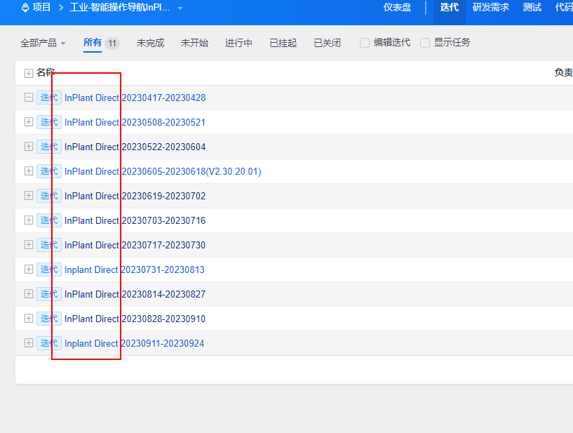

# 敏捷催催企业微信群机器人说明

## 催催效果

## 请作者喝一杯美式刷锅水


## 功能
自动统计当前项目的当前迭代的：
* 总计工作量
* 昨日工作量

并将昨日漏填的名单存入文件夹下记录。
当前仅支持对单项目单迭代的统计，且没有自动爬取工号。

## 数据来源&统计规则

1. 对于日志来源：
数据来源为登录人的账号可见的当前迭代的全部日志
2. 对于工作日的判定：
通过登陆人的账号密码登录ehr抓取(当前判断逻辑)。
由``施尹志``的代码改编而来。[传送门点这里](http://rdm.rd.supcon.com:2000/confluence/pages/viewpage.action?pageId=49643542)
3. 为防止编辑操作被计入，当日志对应的消耗工作量为0，会被认为无效日志；

## 运行环境
`Python`
需要安装插件：`lxml`,`requests`
推荐文本编辑器为`VSCode`
## 喂饭级使用教程
### 1. 在企业微信群创建一个机器人


此时，会自动打开机器人的网络页面

记住机器人的webHook，配置` definition.py`时需要用到
 * tip: 如果你忘记了机器人的webHook地址，可以在群里找到机器人，点击后会看到这个地址
### 2. 下载敏捷催催源码

下载后的压缩包解压到自己想要的路径。(后文以```%path%```替代)
打开`%path\code `
### 3. 配置definition.py
* 用NotePadd++/VSCode等打开` %path%\Code\definition.py`
* 修改`account,password,oaAccount, oaPassword`分别为：你的禅道账户名、禅道密码、oa用户、oa密码。当然，如果你的oa用户和禅道用户一样，oa密码和禅道密码一样，你可以只填`account`h和`password`，不改`oaAccount`和`oaPassword`
* 登录自己的禅道，打开项目列表，找到自己负责的项目

复制项目名称，修`project`的值为你的项目
* 【如果你的项目里面不止一个产品】打开自己的项目，找到你的产品所属迭代，迭代名称内包含的你的产品名，填入`product`，例如下图我可以填写`Direct`

* 【如果你的项目只有一个产品】设置`product`为空字符串
* 修改`boturl`为你企业微信群的机器人webHook地址
* 按照现有格式修改`name_ids`为你项目组中开发人员的`"姓名","工号"`的对应关系。(如果输入错误，将无法正确@到人)。注意，姓名为禅道的姓名
* 填写`forgetRecordPath`，支持绝对路径和相对路径，记录历史的忘填日志情况。如果你和我们项目组一样，对于漏填有奖惩措施，可以填写；如果你们没有对应措施，那就可以填空字符串
### 4. 配置Python环境(如果你下载的是release包，请忽略此步骤)
* 去[Python官网](https://www.python.org/downloads/)下载Python安装包并安装(如果安装失败，可以[来这里](https://www.baidu.com)或者[这里](https://cn.bing.com/)检索)
* 下载[这个链接](https://pip.pypa.io/en/stable/installation/#get-pip-py)下载安装pip的安装文件，下载的文件名为`get-pip.py`
* 在pip安装文件的文件夹地址栏输入`cmd`打开命令行运行
* 在命令行中输入`python get-pip.py`，等待命令行跑完
* 增加电脑的`Path`环境变量`C:\Users\yepeng1\AppData\Local\Programs\Python\Python311\Scripts`(具体路径和Python版本有关，可以在`C:\Users\yepeng1\AppData\Local\Programs\Python`路径下找一下一个`Python***`的文件夹，进入后找到`Scripts`)
### 5. 安装依赖(如果你下载的是release包，请忽略此步骤)
* 关闭已经打开的命令行，重新打开一个命令行
* 通过`pip install requests`安装`requests`插件
* 通过`pip install lxml`安装`lxml`插件

### 6. 配置自动触发(如果有需要)
* 打开你电脑的`任务计划程序`
* 在程序的左侧有一个`任务计划程序库`，右键创建任务
* 可参考如下填写


## 运行逻辑
1. 登录
1. 在项目列表中查找设置的项目
1. 在项目中查找当前日期所属的迭代
1. 爬取当前迭代的日志(过滤无效日志)
1. 统计日志的耗时、日志人
1. 记录漏填人
1. 发送推送

# 已知问题&未来计划
* 问题：请假、出差人员没有填写禅道仍会被@，如果开启了记录，还会被记录未填。
改进方案：如果当前登陆人为管理干部，可以抓取下属的请假记录、出差记录。
方案缺陷：要求下属必须提前完成请假和出差流程。
* 需求：抓取禅道记录推送
* 改进项：历史记录使用数据库实现。
* 改进项：抓工号
